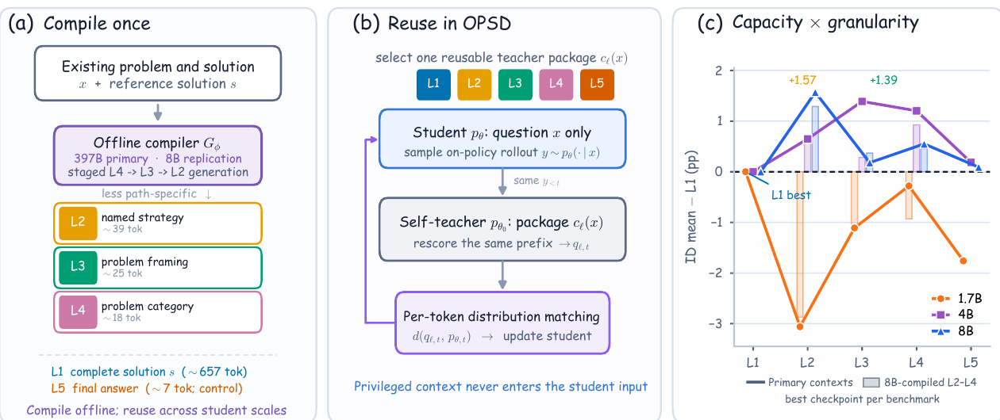
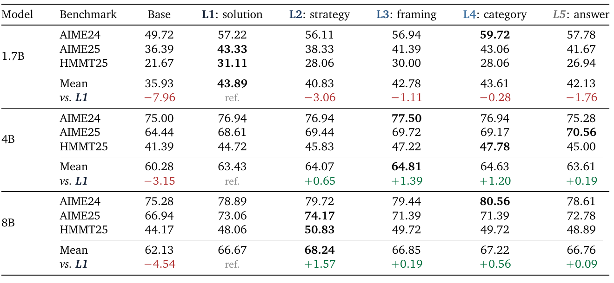

<div align="center">

<h1>What Should a Self-Teacher See?</h1>
<h3>Privileged Context Design for On-Policy Self-Distillation</h3>

<p>
  <strong>Kanghui Tian</strong>, Siyuan Liu, Tianxiang Jiang, Shuai Dong,
  Yizhuo Li, Tian Ding, Yuan Guo, Songze Li, Haowen Hou, Congcong Wang,
  and Yi Wang
</p>

<p>
  <a href="paper/what-should-a-self-teacher-see.pdf"></a>
  <a href="#quick-start"></a>
  <a href="#citation"></a>
</p>

<p><em>Official code, aligned L1--L5 contexts, and compact results for the paper.</em></p>

</div>

<p align="center">
  
</p>

<p align="center"><em>Compile once, reuse across scales: the student sees only the problem while the frozen self-teacher receives one privileged context package.</em></p>

> [!NOTE]
> The arXiv identifier is pending. The current paper is available as a
> [repository PDF](paper/what-should-a-self-teacher-see.pdf).

> [!IMPORTANT]
> **TL;DR:** More privileged information is not always better supervision.
> Intermediate semantic contexts beat complete solutions at 4B and 8B while
> using an order of magnitude fewer hint tokens.

## Method at a glance

More privileged information does not always make a better teacher. We study
this tension in on-policy self-distillation (OPSD), where a frozen copy of the
base model scores the student's own rollouts while observing teacher-only
context. Instead of assuming that a complete reference solution is always the
best context, we compare five levels:

| Level | Teacher-only context | Mean hint tokens |
|---|---|---:|
| L1 | Complete reference solution | 657.3 |
| L2 | Named strategy or method | 38.9 |
| L3 | Method-independent problem framing | 25.2 |
| L4 | Mathematical domain and object category | 17.7 |
| L5 | Final answer only | 6.7 |

The student always sees the problem alone. The selected context is supplied
only to the frozen self-teacher when it scores the student's on-policy tokens.

## Key findings

- In the primary runs, the best intermediate context improves the in-domain
  peak mean over the full solution by 1.39 percentage points at 4B and 1.57
  points at 8B.
- L2--L4 use 16.9--37.1 times fewer stored hint tokens than L1.
- Answer-only conditioning remains competitive at the larger scales, within
  0.2 points of L1 at both 4B and 8B.
- The preferred context changes with model scale and evaluation task.
- Initial teacher--student KL does not order downstream student performance.

Primary in-domain peak Avg@12 results (seed 42):

| Model | Base | L1 | L2 | L3 | L4 | L5 |
|---|---:|---:|---:|---:|---:|---:|
| Qwen3-1.7B | 35.93 | **43.89** | 40.83 | 42.78 | 43.61 | 42.13 |
| Qwen3-4B | 60.28 | 63.43 | 64.07 | **64.81** | 64.63 | 63.61 |
| Qwen3-8B | 62.13 | 66.67 | **68.24** | 66.85 | 67.22 | 66.76 |

These means average the separately selected checkpoint peaks on AIME 2024,
AIME 2025, and HMMT 2025. The repository also includes selection-free
step-200 results and three-seed summaries; see [`results/`](results/).

<details>
<summary><strong>Full benchmark-level results from Table 1</strong></summary>
<br>

</details>

## Relationship to OPSD

The training implementation extends **Self-Distilled Reasoner: On-Policy
Self-Distillation for Large Language Models**
([paper](https://arxiv.org/abs/2601.18734),
[upstream code](https://github.com/siyan-zhao/OPSD), commit
`7448751f307a9cdbcc1246dd1565a1a605b443df`). The upstream method conditions a
frozen self-teacher on a complete reference solution. This release adds the
L1--L5 teacher-context interface, local aligned-data loading, the compiler used
for L2--L4, and the evaluation protocols used in our paper.

See [`NOTICE.md`](NOTICE.md) for attribution and the exact licensing scope.

## Repository contents

```text
assets/            paper figures used by this README
paper/             current manuscript PDF
data/              aligned L1--L5 training data and provenance notes
opsd/              OPSD trainer, context-aware collator, and environment
hint_generation/   staged L4 -> L3 -> L2 compiler and L5 construction
eval/              in-domain and transfer-benchmark evaluators
scripts/           portable generation, training, and evaluation launchers
tools/             data validation and benchmark preparation
manifests/         evaluation fingerprints and fixed GPQA option order
results/           compact tables for the reported experiments
```

The release intentionally excludes checkpoints, logs, cluster-specific
launchers, experiment-tracking data, per-item generations, and model-judge
annotations.

## Quick start

Run commands from the repository root:

```bash
conda env create -f opsd/environment.yml
conda activate opsd
pip install flash-attn==2.8.3 --no-build-isolation
pip install openai tqdm pandas pyarrow

python tools/context_data.py validate \
  --input data/privileged_contexts_l1_l5.jsonl
sha256sum -c CHECKSUMS.sha256
```

The experiments require Linux, CUDA-capable GPUs, and enough accelerator
memory for the selected Qwen3 checkpoint. The paper's training runs use eight
GPUs per model.

## Training data

`data/privileged_contexts_l1_l5.jsonl` contains 29,434 aligned rows in the
exact training order. Each row contains the original problem and five
teacher-only contexts:

```text
sample_id, source, problem,
L1_full_solution, L2_strategy, L3_framing, L4_category, L5_answer_only
```

The primary L2--L4 contexts were compiled offline with
Qwen3.5-397B-A17B. L1 is the original reference solution, while L5 preserves
the exact answer-only context used in training. See [`data/README.md`](data/README.md)
before downloading or redistributing the data.

## Generate contexts

Start an OpenAI-compatible endpoint for the compiler, then run:

```bash
API_BASE=http://localhost:8000/v1 bash scripts/generate_contexts.sh
```

The generator applies the staged L4 -> L3 -> L2 contracts, preserves L1 and
L5, validates row alignment, and writes a training-ready combined JSONL. To
replicate the Qwen3-8B compiler condition from the paper:

```bash
MODEL_NAME=Qwen/Qwen3-8B ENABLE_THINKING=1 TEMPERATURE=0.6 \
TOP_P=0.95 TOP_K=20 MAX_TOKENS=8192 \
API_BASE=http://localhost:8000/v1 bash scripts/generate_contexts.sh
```

## Train

For example, to train the 4B L3 condition with seed 42:

```bash
MODEL_SCALE=4B HINT_LEVEL=L3 SEED=42 bash scripts/train_opsd.sh
```

`HINT_LEVEL` selects one L1--L5 field. The student sees the problem alone; the
selected field enters only the frozen teacher context. `DRY_RUN=1` prints the
resolved launch command without training.

| Scale | GPUs | Batch/GPU | Accumulation | Component clip |
|---|---:|---:|---:|---:|
| 1.7B | 8 | 4 | 2 | 0.05 |
| 4B | 8 | 4 | 1 | 0.05 |
| 8B | 8 | 2 | 2 | 0.06 |

All scales use 200 optimizer steps, checkpoints every 25 steps, LoRA
rank/scaling 64/128, learning rate `5e-6`, and rollout sampling with
temperature 1.1, top-p 0.95, and top-k 20.

## Evaluate

The repository does not redistribute evaluation datasets. Install the three
in-domain datasets directly and provide local files for MT-AIME,
GPQA-Diamond, AutoLogi, and ZebraLogic:

```bash
python tools/prepare_eval_data.py --download-id \
  --mt-aime-file /path/to/mt-aime2024.parquet \
  --gpqa-file /path/to/gpqa_diamond.parquet \
  --autologi-file /path/to/AutoLogi_en.jsonl \
  --zebralogic-file /path/to/zebralogic.parquet

MODEL_SCALE=4B HINT_LEVEL=L3 SEED=42 EVAL_SUITE=id \
  bash scripts/evaluate.sh
MODEL_SCALE=4B HINT_LEVEL=L3 SEED=42 EVAL_SUITE=transfer \
  bash scripts/evaluate.sh
```

`manifests/evaluation_data.json` records row counts and content fingerprints;
`manifests/gpqa_option_order.json` fixes the GPQA option order.

## Citation

The current manuscript is included at
[`paper/what-should-a-self-teacher-see.pdf`](paper/what-should-a-self-teacher-see.pdf).
Until the arXiv identifier is assigned, cite the paper as:

```bibtex
@article{tian2026selfteacher,
  title   = {What Should a Self-Teacher See? Privileged Context Design for
             On-Policy Self-Distillation},
  author  = {Tian, Kanghui and Liu, Siyuan and Jiang, Tianxiang and Dong, Shuai
             and Li, Yizhuo and Ding, Tian and Guo, Yuan and Li, Songze and
             Hou, Haowen and Wang, Congcong and Wang, Yi},
  year    = {2026},
  note    = {arXiv preprint; identifier forthcoming}
}
```

Machine-readable citation metadata are provided in [`CITATION.cff`](CITATION.cff).

## Authors and affiliations

- Kanghui Tian — Fudan University; Shanghai Artificial Intelligence Laboratory
- Siyuan Liu — Nanjing University
- Tianxiang Jiang — Shanghai Artificial Intelligence Laboratory
- Shuai Dong — Fudan University
- Yizhuo Li — Shanghai Jiao Tong University
- Tian Ding — Peking University
- Yuan Guo — University of California, Los Angeles
- Songze Li — Fudan University
- Haowen Hou — Shanghai Jiao Tong University
- Congcong Wang — Tongji University
- Yi Wang — Shanghai Artificial Intelligence Laboratory (corresponding author)

## Licensing and third-party materials

This repository contains adapted upstream code and derived data with different
licensing conditions. Public availability does **not** place the entire
repository under a single blanket license. In particular, the local upstream
OPSD snapshot and training-data snapshot did not contain sufficient
repository-wide licensing information for us to assert MIT or Apache-2.0 over
all files.

`opsd/opsd_trainer.py` retains its Hugging Face copyright and Apache-2.0
header; the corresponding license text is included under `LICENSES/`. Dataset
and source-specific terms continue to apply. See [`NOTICE.md`](NOTICE.md) and
[`data/README.md`](data/README.md) before reuse or redistribution.

## Acknowledgements

We thank the authors of OPSD and the maintainers of the models and benchmarks
used in this study. This work was performed at Shanghai Artificial
Intelligence Laboratory.
